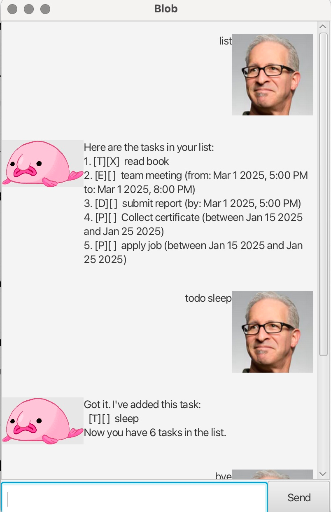

# Blob User Guide



This is Blob. Your personalised chatbot assistant. Whether you're a student, professional, or anyone in between, Blob adapts to your needs, offering a seamless and intuitive way to keep your life organized.

## Adding Todos

Creates a task with the given description.
Example: `todo read book`

Output:

```
Got it. I've added this task:
 [T][] read book
Now you have 1 tasks in the list.
```

## Adding deadlines

Creates a task with a specific deadline. 
The date and time must be provided using the /by command in the format yyyy-mm-dd hh:MM.

Example: `deadline submit report /by 2025-03-01 1700`

Output:

```
Got it. I've added this task:
 [D][] submit report (by: Mar 1 2025, 5.00PM)
Now you have 2 tasks in the list.
```

## Adding Events

Creates a task with a start and end date.
The date and time must be provided using the /from and /to command in the format yyyy-mm-dd hh:MM.

Example: `event team meeting /from 2025-03-01 1700 /to 2025-03-01 2000`

Output:

```
Got it. I've added this task:
 [E][] team meeting (from: Mar 1 2025, 5.00PM
to: Mar 1 2025, 8:00PM)
Now you have 3 tasks in the list.
```

## Adding Period task

Creates a task with a period.
The date and time must be provided using the /between and /and command in the format yyyy-mm-dd.

Example: `period Collect certificate /between 2025-01-15 /and 2025-01-25`

Output:

```
Got it. I've added this task:
 [P][] Collect Certificate (between: Jan 15 2025 
and Jan 25 2025)
Now you have 4 tasks in the list.
```

## Mark Tasks

Marks the task with the specified number as done. 

Example: `mark 1`

Output:
```
Nice! I've marked this task as done:
 [T][X] read book
```

## Unmark Tasks

Unmarks the task with the specified number as not done.

Example: `unmark 1`

Output:
```
OK, I've marked this task as not done yet:
 [T][] read book
```

## Delete Tasks

Delete the task with the specified number.

Example: `delete 1`

Output:
```
Noted. I've reomoved this task:
 [T][] read book
Now you have 8 tasks in the list.
```

## Find Tasks

Find tasks which match the specified keywords.

Example: `find meeting`

Output:
```
Here are the matching tasks in your list:
1. [E][] team meeting (from: Mar 1 2025, 5.00 PM
to: Mar 1 2025, 8.00 PM)
```

# List Tasks

Displays the tasks which are currently in your list

Example: `list`

Output:
```
Here are the tasks in your list:
1. [E][] team meeting (from: Mar 1 2025, 5.00 PM
to: Mar 1 2025, 8.00 PM)
2. [D][] submit report (by: Mar 1 2025, 5:00 PM)
```

# Exit Application

Exits the application, saving and updating all tasks ti the storage

Example: `bye`

Output:
```
Bye. Hope to see you again soon!
```

